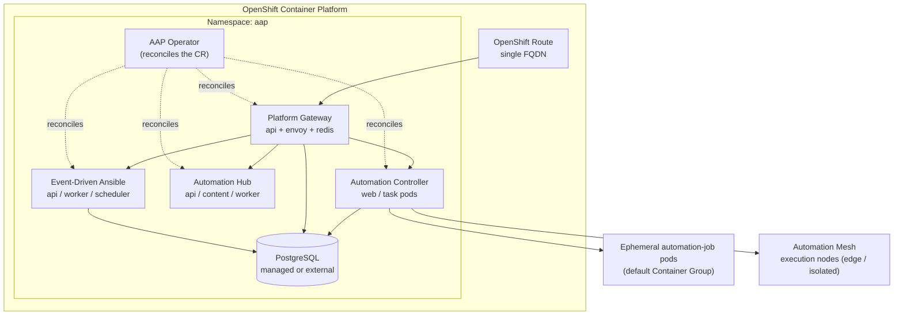

# Ansible Automation Platform on OpenShift: An Architect's Field Guide

> [!NOTE]
> **Who this is for**
> You already run OpenShift in production and you already write Ansible. This guide does not re-explain Operators, Routes, playbooks, or forks. It connects the two worlds: how to **plan**, **install**, **audit**, and **right-size** Ansible Automation Platform (AAP) 2.6 as a first-class OCP workload.

The deployment-model question is effectively settled. RPM-based installation was deprecated in AAP 2.5, AAP 2.6 is the **last release that ships an RPM installer** (RHEL 9 only), and from AAP 2.7 onward the only supported footprints are *containerized on RHEL* and *Operator-based on OpenShift*. If OCP is already your platform, the AAP Operator is the strategic landing zone — and AAP 2.4 reaches end of Maintenance Support on **30 June 2026**, so this is a now-problem, not a someday-problem.

This guide is built around the four phases of an engagement:

1. **Plan** — turn workload reality into a topology and a parameter set.
2. **Install** — map the plan onto the `AnsibleAutomationPlatform` custom resource.
3. **Audit** — walk into a site where AAP already exists and reconstruct what was actually built.
4. **Operate** — find issues, measure real capacity, and compare *needed* against *existing* resources.

---

## Phase 1 — Planning

Planning AAP on OCP is a sequence of binding decisions. Each one closes doors later, so treat this phase as producing a signed-off **design record**, not a wishlist.

### 1.1 Deployment model and topology

On OpenShift, AAP runs as a set of Deployments managed by the AAP Operator. Red Hat publishes two *tested* Operator topologies — deploying outside them is "commercially reasonable support" territory, not full support.

| Topology | Shape | Indicative footprint | Use it when |
|---|---|---|---|
| **Operator growth** | Single Node OpenShift (SNO), no component redundancy | 32 GB RAM, 16 vCPU, 128 GB disk, ~3000 IOPS | PoC, small teams, non-critical automation |
| **Operator enterprise** | Multi-node OCP, replicated components, external DB | Sized to workload | Production, anything with an SLA |

> [!WARNING]
> **One Operator per namespace**
> You can install **only one instance** of the AAP Operator into a given namespace. Two instances in the same namespace will fight over reconciliation and corrupt both deployments. Plan namespaces accordingly.

The architectural model to internalize:



### 1.2 Operator scope: namespace vs cluster

The Operator ships in two OperatorHub channels and the choice is a governance decision, not a technical preference:

- **`stable-2.6`** — namespace-scoped. The Operator watches and deploys only into its own namespace. No cluster-admin required, smaller RBAC blast radius, lower resource overhead. This is the default recommendation.
- **`stable-2.6-cluster-scoped`** — the Operator can manage AAP CRs across multiple namespaces and requires cluster-wide privileges.

> [!TIP]
> **Default to namespace-scoped**
> Unless you have a concrete multi-tenant requirement where one platform team operates AAP instances for many app teams, choose namespace-scoped. It keeps AAP inside normal OCP project-admin boundaries.

### 1.3 Data tier: managed vs external PostgreSQL

The Operator can deploy and manage a PostgreSQL instance for you, or you can point every component at an **external** database via a Kubernetes Secret (`postgres_configuration_secret`).

Decide based on these constraints:

- **Managed (Operator-deployed)** — fastest path, fewest moving parts, fine for growth/PoC. The database becomes a pod with a PVC; its durability is your PVC's durability.
- **External** — required in practice for production, mandatory for serious DR. A DBA-owned, HA PostgreSQL cluster gives you backup tooling, point-in-time recovery, and a clean ownership boundary between the OCP team and the data team. In active-active multi-site designs, each site typically gets its own external HA PostgreSQL with **no cross-WAN replication** — isolation is deliberate to avoid corruption, and historical audit is offloaded to external log aggregation.

> [!NOTE]
> **Plan connection budget early**
> Controller, gateway, and EDA all open connections. If you go external, agree a `max_connections` ceiling with the DBA now — you will set `database.postgres_extra_settings` to match.

### 1.4 Storage

Three storage consumers, three different requirements:

- **Automation Hub content** — the file storage backend needs a PVC with **`ReadWriteMany` (RWX)** access mode, because multiple hub pods mount it concurrently. If your only `StorageClass` is RWO, you must either provision an RWX-capable class (CephFS, NFS, Azure Files, EFS) **or** switch the hub to **S3-compatible object storage** (Amazon S3 and Azure Blob are supported). Object storage is the cleaner choice at scale.
- **Database PVC** — if managed, size for growth of job events and ensure adequate IOPS; the tested growth baseline assumes ~3000 IOPS.
- **Controller / EDA working storage** — projects, EE caches, Redis.

> [!WARNING]
> **RWX is the most common install-day blocker**
> A surprising number of failed first installs trace back to a default `StorageClass` that only offers `ReadWriteOnce`. Confirm RWX availability *before* you write the CR, or commit to S3 for the hub up front.

### 1.5 Networking, ingress, and the platform gateway

Since AAP 2.5 the **platform gateway** is the unified front door: a single service that handles authentication, authorization, and UI consolidation across controller, hub, and EDA. Architecturally this means **one FQDN, one Route, one TLS decision** instead of three separate UIs.

Plan for:

- **Ingress object** — OpenShift `Route` (default) or `Ingress`.
- **TLS termination** — `route_tls_termination_mechanism` is `Edge` or `Passthrough`. Edge terminates at the router (simplest, supply a cert); Passthrough delegates TLS to the gateway pod (needed when end-to-end encryption to the pod is mandated).
- **DNS** — one external record pointing at the Route.
- **Custom CA / corporate trust** — air-gapped and corporate-PKI environments need a CA trust bundle so components trust internal registries, SSO, and external DBs.
- **CasC timeouts** — high-volume API operations such as Configuration-as-Code restores can exceed the Route's default 30-second window and surface as HTTP 504/503. Raise `client_request_timeout` in the CR **and** set `haproxy.router.openshift.io/timeout: 1h` on the gateway Route — they work together (see [Route timeout](../performance/openshift-large-inventory.md#82-route-timeout)).
- **EDA event streams** — if external systems push events into EDA, decide now whether the event stream requires **mTLS**; it is configured through the CR.

### 1.6 Execution strategy: container groups vs automation mesh

This is the decision that most distinguishes an OCP-native AAP design, and OCP/Ansible architects routinely conflate the two execution models.

**Container groups** — the OCP-native model. The Operator creates a **default container group at install time**. When a job runs, the controller calls the Kubernetes API directly and spins up an **ephemeral `automation-job-*` pod** from the job's execution environment image. The pod runs `ansible-runner worker`, streams output back to the controller, and is destroyed on completion. This path **does not use Receptor** and is **outside Automation Mesh**. It gives you Kubernetes-native scale-out, quota control, and zero idle execution infrastructure.

**Automation mesh / execution nodes** — Receptor-based. Persistent execution nodes (and, across sites, peered mesh) let you reach targets that container groups cannot: network-isolated segments, edge locations, manufacturing/OT networks, or anywhere you need a single controlled entrypoint into a remote subnet. Mesh execution on OCP-hosted AAP has been supported since AAP 2.3.

> [!TIP]
> **The answer is usually "both"**
> A single controller can drive container groups for burstable, compute-heavy fleet work (patching hundreds of hosts) **and** mesh execution nodes for edge or air-gapped targets. Design the execution plane around *network topology and workload shape*, not around picking a winner.

| Choose container groups when… | Choose mesh execution nodes when… |
|---|---|
| Targets are reachable from the cluster network | Targets sit behind isolated networks / edge links |
| You want on-demand, ephemeral, burstable capacity | You need persistent nodes or local filesystem/storage access |
| You want OCP quotas and scheduling to govern execution | You need Receptor resiliency and cross-site mesh routing |

### 1.7 Component selection

The CR lets you `disabled: true` any optional component. The gateway is mandatory; the rest are decisions:

- **Automation Controller** — effectively always on.
- **Automation Hub** — private content (collections, EE images). Almost always on for enterprises; mandatory for air-gapped.
- **Event-Driven Ansible (EDA)** — enable if you have event-driven use cases. EDA brings its own pods and Redis dependency.
- **Ansible Lightspeed intelligent assistant** — generative-AI assistance, available in AAP 2.6. Note that enabling/upgrading Lightspeed has had upgrade-ordering caveats; treat it as a deliberate add-on.

AAP 2.6 also ships the **automation dashboard** (ROI/insight reporting), the **self-service automation portal** (form-driven launch for non-Ansible SMEs), **policy enforcement** (tech preview), and an **MCP server** (tech preview from 2.6.4) that bridges AI agents such as Claude or Cursor to the platform. Decide which of these are in scope so they appear in the design record rather than as surprises.

### 1.8 Identity and RBAC

The platform gateway is your identity broker. Plan the integration up front: SAML, OIDC, or LDAP against the corporate IdP, plus the team/organization RBAC model. When the gateway runs without SSO, it is the source of truth for permissions; with SSO, map group claims to gateway teams. Stage the SSO secret as a day-0 input (see §2.5).

### 1.9 Capacity model — the part most plans get wrong

Everything else is plumbing. This is the design.

Translate workload into the four numbers that actually size the platform:

1. **Concurrent job count** — how many job templates run simultaneously at peak.
2. **Forks per job** — parallel host connections per run; multiply by concurrency.
3. **Per-fork memory** — a function of EE size and module/playbook behavior.
4. **Control-plane overhead** — controller web/task, gateway, EDA, Redis, and the database.

From those you derive **execution-plane** demand (sum of `automation-job` pod requests/limits) and **control-plane** demand (the static component pods). Both must fit inside (a) the AAP namespace `ResourceQuota` and (b) node `allocatable` capacity. A plan that omits this arithmetic produces pods that either won't schedule (`Pending`) or get `OOMKilled` under load — see Phase 4.

> [!NOTE]
> **Requests vs limits is a real design choice on AAP**
> By default each AAP component sets resource **requests** but **no limits** — OCP schedules on requests, but pods can then consume unbounded CPU/RAM until the node is under pressure. For predictable multi-tenant clusters you will set explicit limits; for the database pod, Red Hat's own performance guidance **matches memory request and limit** to prevent OOM kills. Decide your stance per component.

### 1.10 Air-gapped considerations

If the target OCP cluster is disconnected, add these to the plan:

- Mirror the **Operator catalog** into the cluster (`oc-mirror` with an `ImageSetConfiguration`) and create a `CatalogSource`.
- Mirror the **AAP component images** and all **execution environment images** into the internal registry.
- Stage **image pull secrets** and the **CA trust bundle**.
- Automation Hub is now load-bearing: it is the internal source of truth for collections and EEs.

### Planning output — design-record checklist

- [ ] Topology chosen (growth vs enterprise) and node sizing approved
- [ ] Operator channel chosen (namespace vs cluster-scoped) and namespace named
- [ ] Database decision (managed vs external) and `max_connections` budget agreed
- [ ] RWX `StorageClass` confirmed **or** S3/Blob selected for the hub
- [ ] Ingress type, `route_tls_termination_mechanism`, FQDN, and certs decided
- [ ] Execution strategy defined (container groups / mesh / hybrid)
- [ ] Component set finalized (controller, hub, EDA, Lightspeed, portal, policy)
- [ ] Identity integration (SAML/OIDC/LDAP) and RBAC model defined
- [ ] Capacity arithmetic done: peak forks → CPU/RAM → quota & node fit
- [ ] Air-gapped mirroring plan complete (if applicable)

---

## Phase 2 — Installation options and parameters

With the design record signed off, installation is a faithful translation of those decisions into two objects: the Operator **`Subscription`** and the **`AnsibleAutomationPlatform`** custom resource.

### 2.1 Installing the Operator

Install from OperatorHub (console: **Operators → OperatorHub → Ansible Automation Platform**) or declaratively. The declarative form is preferred for GitOps:

```yaml
apiVersion: operators.coreos.com/v1alpha1
kind: Subscription
metadata:
  name: ansible-automation-platform-operator
  namespace: aap
spec:
  channel: stable-2.6                 # or stable-2.6-cluster-scoped
  name: ansible-automation-platform-operator
  source: redhat-operators           # internal CatalogSource name when air-gapped
  sourceNamespace: openshift-marketplace
  installPlanApproval: Manual         # Manual gives you upgrade control
```

Installation options that matter here:

- **Channel** — must match the Operator scope decided in §1.2.
- **`installPlanApproval`** — `Manual` prevents the Operator from auto-upgrading AAP minor/patch versions out from under you. For production, choose `Manual` and approve `InstallPlan`s deliberately.
- **`source`** — `redhat-operators` when connected; your mirrored `CatalogSource` name when air-gapped.

### 2.2 The AnsibleAutomationPlatform custom resource

One CR drives the whole platform. The Operator owns the nested component CRs (`AutomationController`, `AutomationHub`, `EDA`) — you configure everything on the **parent** `AnsibleAutomationPlatform` object and it disseminates settings downward.

```yaml
apiVersion: aap.ansible.com/v1alpha1
kind: AnsibleAutomationPlatform
metadata:
  name: aap
  namespace: aap
spec:
  # ----- Ingress / front door -----
  route_tls_termination_mechanism: Edge
  client_request_timeout: 120          # raise above default 30s if you run CasC

  # ----- Platform gateway -----
  api:
    replicas: 2
    resource_requirements:
      requests: { cpu: 100m, memory: 256Mi }
      limits:   { cpu: 500m, memory: 1000Mi }
  redis:
    replicas: 1                          # single replica = SPOF for gateway + EDA; raise for HA (see §4.5)

  # ----- Database: omit this block for managed PG; include for external -----
  database:
    # postgres_configuration_secret: external-postgres-configuration
    postgres_extra_settings:
      - name: max_connections
        value: '1000'
    resource_requirements:
      # DB pod: memory request == limit to prevent OOM kills (Red Hat guidance — see §1.9)
      requests: { cpu: 100m, memory: 800Mi }
      limits:   { cpu: 500m, memory: 800Mi }

  # ----- Automation Controller -----
  controller:
    disabled: false
    uwsgi_processes: 2
    task_resource_requirements:
      requests: { cpu: 1000m, memory: 8Gi }
      limits:   { cpu: 4000m, memory: 8Gi }
    web_resource_requirements:
      requests: { cpu: 500m, memory: 1536Mi }
      limits:   { cpu: 2000m, memory: 1536Mi }
    ee_resource_requirements:
      requests: { cpu: 100m, memory: 400Mi }
      limits:   { cpu: 500m, memory: 400Mi }

  # ----- Automation Hub -----
  hub:
    disabled: false
    storage_type: s3                   # 'file' (needs RWX PVC), 's3', or 'azure'
    # object_storage_s3_secret: hub-s3-configuration

  # ----- Event-Driven Ansible -----
  eda:
    disabled: false
```

### 2.3 Parameter reference

The parameters you will most often set, and what each one binds:

| Parameter | Scope | Why it matters |
|---|---|---|
| `route_tls_termination_mechanism` | Ingress | `Edge` vs `Passthrough` — your end-to-end TLS posture |
| `client_request_timeout` | Ingress | Raise above 30s to survive CasC restores and bulk API ops |
| `<component>.disabled` | Per component | Turn EDA/Hub/Lightspeed on or off |
| `<component>.replicas` | Per component | Control-plane HA; pair with multi-node topology |
| `resource_requirements` | Per component | `requests`/`limits` — the heart of capacity tuning |
| `controller.uwsgi_processes` | Controller | Web-tier concurrency for the controller UI/API |
| `controller.task_resource_requirements` | Controller | Sizes the task pod — the busiest controller component |
| `controller.ee_resource_requirements` | Controller | Sizes control-plane EE pods (distinct from job pods) |
| `database.postgres_configuration_secret` | Database | Presence switches you from managed to **external** PG |
| `database.postgres_extra_settings` | Database | Tune `max_connections`, SSL ciphers, etc. |
| `hub.storage_type` | Hub | `file` (RWX PVC) vs `s3`/`azure` object storage |
| `hub.object_storage_s3_secret` | Hub | Binds S3 credentials/bucket config |
| `image_pull_secrets` | Platform | Private/mirrored registry access (air-gapped) |
| EDA event-stream mTLS params | EDA | Mutual TLS for inbound event streams |

> [!NOTE]
> **Job pods are sized separately**
> `ee_resource_requirements` sizes the controller's *internal* EE pods. The ephemeral `automation-job-*` pods spawned by a **container group** are sized by the **container group's pod spec override**, not by the CR. Plan and tune those independently (see §4.4 and the full annotated [`pod_spec_override`](../../reference/config-snippets.md#2-container-group-pod_spec_override)).

### 2.4 Discovering every parameter

Never guess a field. The CRD schema is self-documenting:

```bash
# Top-level AAP spec
oc explain ansibleautomationplatform.spec

# Drill into any nested component
oc explain automationcontroller.spec.postgres_configuration_secret
oc explain automationcontroller.spec.route_tls_termination_mechanism
oc explain automationhub.spec.storage_type
```

In the console, open the CR, switch to the **YAML view**, and use the **Schema** side panel for the same information interactively.

### 2.5 Day-0 secrets to stage before applying the CR

Create these in the AAP namespace **before** the CR, or the Operator will block on missing references:

- **Admin password secret** — the initial platform admin credential.
- **External database secret** — host, port, database, user, password, SSL mode (only if external).
- **Object storage secret** — bucket, region, access keys (only if `storage_type: s3`/`azure`).
- **SSO secret** — IdP metadata/keys for SAML or OIDC.
- **Image pull secret** + **CA trust bundle** — for private/mirrored registries and corporate PKI.

---

## Phase 3 — Auditing an existing installation

You will frequently inherit an AAP deployment instead of building one. The goal of this phase is to reconstruct the *as-built* design and compare it against the *as-designed* record — or, if there is no record, create one.

### 3.1 What version is actually running

```bash
# Operator version and health
oc get csv -n aap
oc get subscription -n aap -o yaml | grep -E 'channel|installPlanApproval'

# The AAP instance and its components
oc get ansibleautomationplatform,automationcontroller,automationhub,eda -n aap
```

The `ClusterServiceVersion` tells you the Operator version; the subscription `channel` confirms namespace vs cluster scope and approval mode. Cross-check the AAP version against the lifecycle page — anything on **2.4 is past end of Maintenance Support** as of 30 June 2026 and needs a migration plan.

### 3.2 Reading the deployed CR

The single most informative command — the CR *is* the as-built design:

```bash
oc get ansibleautomationplatform aap -n aap -o yaml
```

Reconstruct the design record from `.spec`:

- `route_tls_termination_mechanism`, `client_request_timeout` → ingress posture
- presence of `database.postgres_configuration_secret` → managed vs external DB
- `hub.storage_type` → file/RWX vs object storage
- `<component>.disabled` flags → which components are live
- every `resource_requirements` block → the current sizing stance

Then inspect `.status.conditions` for the reconcile state (`Successful`, `Running`, `Failure`).

### 3.3 Component health and shape

```bash
oc get pods -n aap -o wide                       # all component pods + node spread
oc get pods -n aap --field-selector=status.phase!=Running
oc get routes -n aap                             # the platform FQDN
oc get pvc -n aap                                # storage + ACCESS MODES column
oc get pods -n aap -l app.kubernetes.io/component=database
```

What to verify against the plan: pod replica counts match the intended HA level; the hub PVC shows `RWX` if `storage_type: file`; pods are spread across nodes (not all stacked on one); and a `postgres`/`database` pod **exists** (managed) or is **absent** (external — confirmed by the secret).

### 3.4 Controller-side reality check

The CR tells you infrastructure intent; the controller API tells you operational truth. Hit these read-only endpoints (or use the UI):

- **`/api/v2/ping/`** — instances, instance groups, and mesh topology as the controller sees it.
- **`/api/v2/instances/`** — per-instance `capacity`, `consumed_capacity`, and CPU/memory the controller has accounted for.
- **`/api/v2/instance_groups/`** — including the **default container group** created at install; check `max_concurrent_jobs`, `max_forks`, and policy.
- **`/api/v2/settings/all/`** — `DEFAULT_FORKS`, system job concurrency, and tuning that affects load.

For deeper inspection, exec into the controller task pod:

```bash
oc rsh -n aap deploy/aap-controller-task
awx-manage list_instances        # mesh / instance topology and heartbeats
```

> [!TIP]
> **Audit deliverable**
> Produce a one-page *as-built vs as-designed* table. Every divergence is either an undocumented decision to ratify or a defect to fix. There is no third category.

---

## Phase 4 — Issues, performance, and capacity

This phase answers the three questions an architect is actually paid for: **Is it healthy? How much can it really do? Does it have the resources for what's coming?**

### 4.1 Triage: pods, events, and the reconcile loop

Work outside-in:

```bash
# Operator reconcile — start here if the CR won't converge
oc logs -n aap deploy/ansible-automation-platform-operator-controller-manager

# Cluster-level symptoms
oc get events -n aap --sort-by=.lastTimestamp
oc describe pod <pod> -n aap          # look for OOMKilled, FailedScheduling, ImagePullBackOff
```

Common signatures and their meaning:

- **`OOMKilled`** — a `limits.memory` is below real demand. Raise the relevant `*_resource_requirements`. For the database pod, match request and limit.
- **`FailedScheduling` / `Pending`** — `requests` exceed node `allocatable`, or a `ResourceQuota` is exhausted. This is a capacity problem, not a config typo.
- **`ImagePullBackOff`** — registry/pull-secret/mirror issue; central in air-gapped clusters.
- **`CrashLoopBackOff` on a component** — read that pod's logs; if the Operator can't reconcile, the root cause is usually upstream (DB unreachable, secret missing).

### 4.2 The capacity equation

AAP capacity is denominated in **forks**. Each instance and each instance/container group advertises a capacity figure; running jobs consume it via `consumed_capacity`; `remaining_capacity` is your live headroom. Read it from `/api/v2/instances/` and `/api/v2/instance_groups/`.

The chain to reason about:

```
peak concurrent jobs  ×  forks per job  =  peak fork demand
peak fork demand      ×  per-fork RAM   =  execution-plane memory demand
peak fork demand      ×  per-fork CPU   =  execution-plane CPU demand
```

Job slicing splits one job template run across multiple `automation-job` pods, multiplying parallelism — and multiplying demand. Account for it explicitly: the exact gating math — and why a high slice count does *not* mean all slices run at once — is in [Job Slicing & Concurrency](../concurrency/job-slicing-and-concurrency.md#sec-3).

### 4.3 Existing resources vs needed resources

This is the comparison the brief asks for. Put **demand** and **supply** side by side:

**Supply — what the cluster actually offers**

```bash
oc adm top nodes                              # live node CPU/memory usage
oc describe node <worker>                     # 'Allocatable' and 'Allocated resources'
oc describe quota -n aap                      # ResourceQuota: used vs hard
oc describe limitrange -n aap                 # per-pod min/max constraints
oc adm top pods -n aap                        # live AAP component consumption
```

**Demand — what AAP needs**

- *Control plane:* the sum of every component's `requests` in the CR — static, always reserved.
- *Execution plane:* peak-fork demand (§4.2) translated into the container group pod spec's requests/limits, times the number of concurrent `automation-job` pods.

**The verdict.** Lay it out as a table — control-plane requests + peak execution-plane requests in one column, namespace quota and node allocatable in the other:

| Outcome | Symptom | Action |
|---|---|---|
| Demand < supply, comfortable | Jobs run, headroom remains | Healthy — record the margin |
| Demand ≈ supply | Occasional `Pending` job pods at peak | Add worker capacity or raise quota *before* growth |
| Demand > supply | Sustained `Pending`, queue backlog | Under-provisioned — scale nodes/quota now |
| Limits set too low | `OOMKilled` job or component pods | Raise `limits`; re-derive per-fork memory |
| Requests set too high | Pods `Pending` despite idle nodes | Right-size `requests` downward to real usage |

> [!WARNING]
> **Requests are promises, limits are ceilings**
> A cluster can look "empty" in `oc adm top` and still refuse to schedule AAP pods, because OpenShift schedules on **requests**, not on live usage. When job pods sit `Pending` on an apparently idle cluster, audit `requests` against node `allocatable` before adding hardware.

### 4.4 Container group pressure

Container-group execution has a failure mode unique to OCP. When the Kubernetes API rejects pod creation because a `ResourceQuota` is exceeded, the controller does **not** fail the job — it holds it **`pending`** indefinitely. Other failures surface in the job's Error Details, e.g. a `pods is forbidden ... cannot create resource "pods"` message pointing at a missing RBAC role on the container group's service account.

Checklist when container-group jobs stall:

- [ ] `oc describe quota -n <execution-namespace>` — is pod/CPU/memory quota exhausted?
- [ ] Service account has `get`/`create`/`delete` on `pods` (and `secrets`, if the EE uses a registry credential) in the execution namespace
- [ ] The container group pod-spec override targets the **correct namespace** (never `default`)
- [ ] The execution environment image is pullable from where the job pod lands
- [ ] Job-pod requests/limits in the pod spec are realistic for the playbook's fork count

> A `pending` container-group job is only one of several gates that throttle real concurrency. For the full set — template, instance/container group, controller caps, platform quota, and managed-host limits — see the [five gates](../concurrency/job-slicing-and-concurrency.md#sec-2).

### 4.5 Database and Redis

The database is the most common silent bottleneck:

- **Connection exhaustion** — controller + gateway + EDA can outgrow `max_connections`. Symptom: intermittent connection errors under load. Fix via `database.postgres_extra_settings`.
- **IOPS starvation** — job-event writes are heavy; an undersized PVC `StorageClass` throttles the whole platform. The PostgreSQL knobs that matter at scale are in [config-snippets §3](../../reference/config-snippets.md#3-postgresql-tuning).
- **Concurrency races** — keep current on patch releases; concurrent-job bugs that mishandled host facts have been fixed in maintenance streams.

Redis underpins the gateway and EDA; a Redis failover can stall EDA activations until pods recycle — a known operational caveat worth alerting on.

### 4.6 Observability — make the platform tell you

Stop guessing. Wire AAP into monitoring:

- The controller exposes a **Prometheus metrics endpoint** (`/api/v2/metrics/`). Scrape it with OpenShift **user-workload monitoring**, or into an external Prometheus, and dashboard it in Grafana.
- The AAP 2.6 **automation dashboard** gives ROI and job-outcome reporting natively.
- Forward component and job logs to external aggregation (Splunk, Elastic, Loki) — essential for multi-site designs where no single AAP instance holds the full history.

> [!TIP]
> **Capacity is a trend, not a snapshot**
> A point-in-time `oc adm top` tells you almost nothing. Trend `remaining_capacity`, job queue depth, `automation-job` pod `Pending` time, and database connection count over weeks. The moment the trend line bends, you have your "needed vs existing" answer — with lead time to act on it.

---

## Closing: the decision summary

For an architect already fluent in OCP and Ansible, AAP on OpenShift collapses to a small set of binding decisions made in the right order:

1. **Topology** — growth or enterprise; one Operator per namespace.
2. **Scope** — namespace-scoped unless multi-tenancy is a hard requirement.
3. **Data** — external PostgreSQL for anything production; budget connections.
4. **Storage** — RWX or S3 for the hub, decided before the CR is written.
5. **Front door** — one gateway, one Route, one deliberate TLS posture.
6. **Execution** — container groups for cluster-reachable scale-out, mesh for the edge, usually both.
7. **Capacity** — forks → CPU/RAM → quota and node fit, validated continuously.

Get those right and AAP behaves like any other well-architected OCP workload: declarative, observable, and predictable. Manage the `AnsibleAutomationPlatform` CR in Git, reconcile it with your existing GitOps pipeline, and the platform that automates everything else finally gets automated itself.

> [!NOTE]
> **Living document**
> AAP 2.7 (containerized-only, June 2026) removes the RPM installer entirely. Revisit the migration sections of this guide as 2.7 GAs and as your clusters move off 2.4/2.5.
